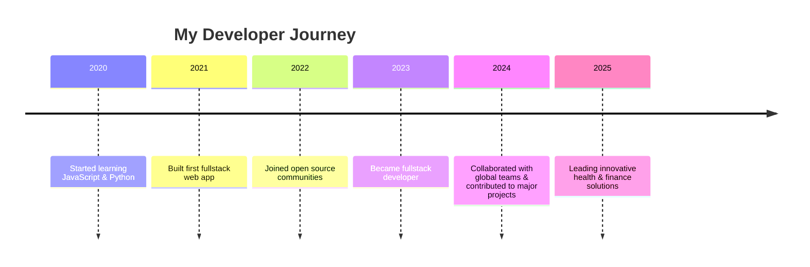

<p align="left">
  
</p>
<!-- <p align="right">
  
</p> -->
<!-- Animated Gradient Banner -->
<p align="center">

<!--    alt="Neon Banner" width="100%" /> -->
</p>

<!-- Typing effect intro -->
<p align="center">
  
</p>

<!-- Profile picture and social links -->
<p align="center">
  
    <br/>
  <a href="https://sadiqharuna.netlify.app"></a>
  <a href="mailto:harunakadiri702@gmail.com"></a>
  <a href="https://api.whatsapp.com/send?phone=+2347032151593"></a>
</p>

---

## 🚀 About Me

```diff
+ 👋 Hi, I’m @SADIQ HARUNA
+ 👀 I love coding and creative problem solving
+ 🌱 Fullstack developer, passionate about tech
+ 💞️ Collaborating to achieve great goals!
+ 📫 Reach me at [Website](https://sadiqharuna.netlify.app), [Email](mailto:harunakadiri702@gmail.com), or [WhatsApp](https://api.whatsapp.com/send?phone=+2347032151593)
```

---

## 🗺️ My Tech Journey (Timeline)



---

## 🛠️ Skills & Tools

<div align="center">
  
</div>

---

## 🏆 GitHub Stats & Trophies

<div align="center">
  
  <br>
  
  <br>
  
  
  <br>
  
</div>

---


---
<p align="center">
📊 Weekly Development Breakdown
JavaScript    ████████████████████▋░░   82.5%
TypeScript    ██████▊░░░░░░░░░░░░░░░░   24.3%
Python        █████▌░░░░░░░░░░░░░░░░░   20.1%
HTML          ██▊░░░░░░░░░░░░░░░░░░░░   8.7%
CSS           ██▌░░░░░░░░░░░░░░░░░░░░   7.9%
</p>
---

## 🌟 Featured Projects

<table>
  <tr>
    <td align="center">
      <a href="https://github.com/MyLikita-Health/mylikitav3">
<!--          -->
        
        <br/><b>MyLikita Health</b>
      </a>
      <br/>
      <sub>Health management platform</sub>
    </td>
    <td align="center">
      <a href="https://github.com/Charly070321/kanohackathon">
<!--          -->
        
        <br/><b>School Management System</b>
      </a>
      <br/>
<!--       <sub>School Platform</sub> -->
    </td>
    <td align="center">
      <a href="https://github.com/bits-his/budget-frontend">
<!--          -->
        
        <br/><b>Award-Winning AI Healthcare Platform
The Future of
Medical AI
</b>
      </a>
      <br/>
<!--       <sub>Financial management dashboard</sub> -->
    </td>
    <td align="center">
      <a href="https://github.com/Charly070321">
<!--          -->
       
        <br/><b>Telehealth Software Both "Mobile & Web"
The Future of
Medical AI
</b>
      </a>
      <br/>
<!--       <sub>Telehealth Software Both "Mobile & Web"</sub> -->
    </td>
  </tr>
</table>

---

## ✨ Fun Facts

- 🎨 I love creating beautiful UI/UX experiences
- 🌍 I enjoy working in diverse teams and learning new cultures
- 💡 My motto: "Code with purpose, design with passion"
- 🕹️ When not coding, I play chess & explore new tech trends
---

🤝 Collaboration Opportunities
I'm particularly interested in collaborating on projects that:

🏥 Health Technology: Telemedicine, patient management, health data analytics

💰 Financial Solutions: Fintech apps, budgeting tools, payment systems

🌱 Education Technology: E-learning platforms, educational resources

🤖 AI & Machine Learning: Practical applications of AI to solve everyday problems

🌍 Social Impact: Projects that make a positive difference in communities

Ready to build something awesome together?

📬 Reach me via Email or WhatsApp!

💼 Check out my Portfolio for more examples of my work

---

## 🔗 My Socials & Portfolio

---
🔗 Connect With Me
<div align="center"> <a href="https://sadiqharuna.netlify.app"></a> <a href="mailto:harunakadiri702@gmail.com"></a> <a href="https://api.whatsapp.com/send?phone=+2347032151593"></a> <a href="https://linkedin.com/in/sadiq-haruna"></a> <a href="https://twitter.com/SadiqHaruna"></a> <a href="https://github.com/Charly070321"></a> </div>
---

<!-- Pinned Repositories -->
## 📌 Pinned Projects
[](https://github.com/bits-his/budget-frontend)
[](https://github.com/bits-his/budget-frontend)
[](https://github.com/bits-his/budget-frontend)
[](https://github.com/bits-his/budget-frontend)

<!-- Footer Banner -->
<p align="center">
  
  <i>Thank you for visiting my profile! Have a great day! 😊</i> </p>
</p>

---

<!--
Charly070321/Charly070321 is a ✨ special ✨ repository because its `README.md` (this file) appears on your GitHub profile.
You can click the Preview link to take a look at your changes.
-->
