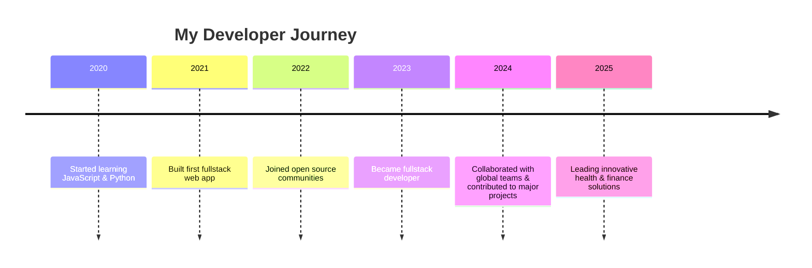

<!-- Animated Gradient Banner -->
<p align="center">

<!--    alt="Neon Banner" width="100%" /> -->
</p>

<!-- Typing effect intro -->
<p align="center">
  
</p>

<!-- Profile picture and social links -->
<p align="center">
  
  <br/>
  <a href="https://sadiqharuna.netlify.app"></a>
  <a href="mailto:harunakadiri702@gmail.com"></a>
  <a href="https://api.whatsapp.com/send?phone=+2347032151593"></a>
</p>

---

## 🚀 About Me

```diff
+ 👋 Hi, I’m @SADIQ HARUNA
+ 👀 I love coding and creative problem solving
+ 🌱 Fullstack developer, passionate about tech
+ 💞️ Collaborating to achieve great goals!
+ 📫 Reach me at [Website](https://sadiqharuna.netlify.app), [Email](mailto:harunakadiri702@gmail.com), or [WhatsApp](https://api.whatsapp.com/send?phone=+2347032151593)
```

---

## 🗺️ My Tech Journey (Timeline)



---

## 🛠️ Skills & Tools

<div align="center">
  
</div>

---

## 🏆 GitHub Stats & Trophies

<div align="center">
  
  <br>
  
  <br>
  
  
  <br>
  
</div>

---

## 🌟 Featured Projects

<table>
  <tr>
    <td align="center">
      <a href="https://github.com/MyLikita-Health/mylikitav3">
        
        <br/><b>MyLikita Health</b>
      </a>
      <br/>
      <sub>Health management platform</sub>
    </td>
    <td align="center">
      <a href="https://github.com/Charly070321/kanohackathon">
        
        <br/><b>Kano Hackathon</b>
      </a>
      <br/>
      <sub>Innovation challenge portal</sub>
    </td>
    <td align="center">
      <a href="https://github.com/bits-his/budget-frontend">
        
        <br/><b>Budget Frontend</b>
      </a>
      <br/>
      <sub>Financial management dashboard</sub>
    </td>
  </tr>
</table>

---

## ✨ Fun Facts

- 🎨 I love creating beautiful UI/UX experiences
- 🌍 I enjoy working in diverse teams and learning new cultures
- 💡 My motto: "Code with purpose, design with passion"
- 🕹️ When not coding, I play chess & explore new tech trends

---

## 🤝 Let's Collaborate!

> **Ready to build something awesome?**
>
> 📬 Reach me via [Email](mailto:harunakadiri702@gmail.com) or [WhatsApp](https://api.whatsapp.com/send?phone=+2347032151593)!
>
> 🧑‍💻 I love working on health, finance, and innovation projects!

---

## 🔗 My Socials & Portfolio

<div align="center">
  <a href="https://sadiqharuna.netlify.app"></a>
  <a href="mailto:harunakadiri702@gmail.com"></a>
  <a href="https://api.whatsapp.com/send?phone=+2347032151593"></a>
</div>

---

<!-- Pinned Repositories -->
## 📌 Pinned Projects

[](https://github.com/MyLikita-Health/mylikitav3)
[](https://github.com/Charly070321/kanohackathon)
[](https://github.com/bits-his/budget-frontend)

---

<!-- Footer Banner -->
<p align="center">
  
</p>

---

<!--
Charly070321/Charly070321 is a ✨ special ✨ repository because its `README.md` (this file) appears on your GitHub profile.
You can click the Preview link to take a look at your changes.
-->
